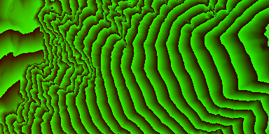
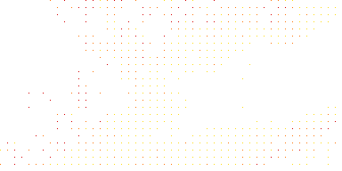

# weBIGeo CLI

The weBIGeo CLI allows to run our avalanche simulation from the command line. The tool takes in a JSON file, specifying all parameters needed and outputs the simulation results into multiple files.

## Synposis
```bash
webigeo_eval PATH_TO_SETTINGS_JSON
```

`PATH_TO_SETTINGS_JSON` is the path to a JSON file, containing a single object, where each field specifies some option. There are three different kinds of settings:
 - paths (e.g. to the height raster)
 - hyper parameters (e.g. number of simulation steps)
 - model parameters (e.g. max runout angle $\alpha$)

See next section for a full reference of available options.

## Settings JSON
### Paths
`aabb_file_path`, **_required_** <br>Specifies the path to a file containing the simulation bounds. See [AABB file format](#aabb-file-format).

`heightmap_texture_path`, **_required_** <br>Specifies the path to a file containing the height raster within the simulation bounds. See [Height file format](#height-file-format).

`release_cells_texture_path`, **_required_** <br>Specifies the path to a file containing the release raster within the simulation bounds. See [Release cells file format](#release-cells-file-format).

`output_dir_path`, **_required_** <br>Specifies the path to a directory where outputs should be written to. The directory will be created, if it does not exist yet. See [Outputs](#outputs).

### Hyper parameters
`resolution_multiplier`, _optional_, Integer, default `1` <br>
Simulation output resolutions are input resolutions times this factor.

`num_simulation_runs`, _optional_, Integer, default `1`<br>
Number of consecutive simulation runs, writing to the same output textures.

`num_particles_per_release_cell`, _optional_, Integer, default `1024` <br>
  Number of particles to release in each release cell.

`num_simulation_steps`, _optional_, Integer, default `10000` <br>
  Maximum number of simulation steps for each particle.

`simulation_step_length`, _optional_, Float, default `0.1` <br>
Length of a single simulation step.

`random_seed`, _optional_, Integer, default `1` <br>
Seed value for the random number generator.

### Model parameters
`max_random_deviation`, _optional_, Float, default `25`<br>
In degrees. Also called $\theta$. At each simulation step, the surface normal at the current particle position is randomly adjusted by an angle that is within [$-\theta$, $+\theta$].

`persistence`, _optional_, Float, default `0.9`<br>
Within [0.0, 1.0]. At each simulation step, the previous direction is taken into account. A value of 0.0 only considers the local terrain at the current particle position. A value of 1.0 only uses the last direction (i.e. the very first direction, by transitivity, so choosing exactly 1.0 leads to straight lines).

`max_runout_angle`, _optional_, Float, default `25`<br>
In degrees. Also called $\alpha$. At each simulation step, the local runout angle is computed as the vertical angle to the starting point along the particles path (up until now). If this angle exceeds $\alpha$, the particle is stopped. This is an implementation of the geometrical concepts introduced by the state-of-the-art avalanche simulation [FlowPy](https://docs.avaframe.org/en/latest/theoryCom4FlowPy.html).


### Example settings JSON file

```
{
    "aabb_file_path": "input/breite-ries/aabb.txt",
    "heightmap_texture_path": "input/breite-ries/heights.png",
    "release_cells_texture_path": "input/breite-ries/release_cells.png",
    "output_dir_path": "output/breite-ries",
    
    "resolution_multiplier": 8,
    "num_particles_per_release_cell": 1024,
    "num_simulation_steps": 10000,
	"random_seed": 1,
	
    "max_random_deviation": 25,
	"persistence": 0.9,
    "max_runout_angle": 25
}

```

## AABB file format
The AABB file defines the spatial extent of the simulation domain in Web Mercator coordinates ([EPSG:3857](https://epsg.io/3857)). It is a plain text file that contains four coordinates as floats (using `.` as decimal separator):

```
min_x
min_y
max_x
max_y
```

Technically, only width and height (in meters) of the simulation region is needed. However, this is the same format used by the weBIGeo renderer.

**Example** ([Breite Ries, Schneeberg, Austria](https://www.openstreetmap.org/way/309980030#map=16/47.77639/15.82053), covering an area of ~1834m $\times$ ~917m):
```
1759886.13923789933323860168457
6069405.79395613446831703186035
1761720.62791674211621284484863
6070323.03829555585980415344238
```

## Height file format
The height raster is stored in a 8-bit RGBA texture. Each texel contains the height as 16-bit binary values in the R and G channels in most-significant-bit-first order (i.e. R contains the first 8 binary digits, G contains the last 8 binary digits).

The lowest possible 16-bit binary value $0$ represents a height of 0 meters and the highest possibly 16-bit binary value $2^{16}-1=65535$ represents a height of 8191.875 meters. All other binary values are linearly interpolated between these minimum and maximum heights.

The other channels (B, A) are ignored. For visually inspecting the textures, it is convenient to set A to 255.

**Example** (DEM of the above defined AABB of [Breite Ries, Schneeberg, Austria](https://www.openstreetmap.org/way/309980030#map=16/47.77639/15.82053) with a spatial resolution of ~4.78m):

<p align="center">
  
</p>

## Release cells file format
The release cell raster defines where to release particles for the avalanche simulation. It is stored as 8-bit RGBA texture and its image resolution must match the resolution of the height raster used. 

A texel is a release cell, if its A channel is greater than 0. All other channels are ignored. The release cell texture can be interpreted as a mask for the height raster. For each release cell, `num_particles_per_release_cell` particles are released within its spatial extent (initial position is uniformly random within the cell).

**Example** (Release cell mask for the above defined AABB of [Breite Ries, Schneeberg, Austria](https://www.openstreetmap.org/way/309980030#map=16/47.77639/15.82053) with a spatial resolution of ~4.78m):

<p align="center">
  
</p>

## Outputs
The following structure is created in the output directory specified in `output_dir_path`.

- `heights/`
  - `aabb.txt`, input AABB
  - `texture.png`, input height raster
- `release_points/`
  - `aabb.txt`, input AABB
  - `texture.png`, input release cell raster
- `normals/`
  - `aabb.txt`, input AABB
  - `texture.png`, computed surface normals for height raster
- `trajectories/`
  - `aabb.txt`, input AABB
  - `texture.png`, color-mapped avalanche paths, see [Model outputs](#model-outputs)
  - `texture_layer1_zdelta.png`, see [Model outputs](#model-outputs).
  - `texture_layer2_cellCounts.png`, see [Model outputs](#model-outputs)
  - `texture_layer3_travelLength.png`, see [Model outputs](#model-outputs)
  - `texture_layer4_travelAngle.png`, see [Model outputs](#model-outputs)
  - `texture_layer5_heightDifference.png`, see [Model outputs](#model-outputs)
- `settings.json`, exact settings used for the simulation run (including default values)
- `timings.json`, time (in milliseconds) taken by each node in the simulation workflow


### Model outputs
The simulation outputs multiple geometric quantities that are aggregated per texel for all particles that travelled throught that texel. Each quantity is written to a separate 8-bit RGBA texture, named `texture_layer[n]_[quantityName].png`.

These textures contain encoded 32-bit float values. Each value is first clamped and normalized to the range of [-10000, 10000] and then converted to a 32-bit binary value, where 0 represents -10000 and $2^{32}-1$ represents +10000. The binary value is then stored in most-significant-bit-first order within the four channels (R has 8 most significant bits, B has 8 next most significant bits, ...).

For a detailed explanation of what each quantities means, see [FlowPy documentation and paper](https://docs.avaframe.org/en/latest/theoryCom4FlowPy). The following geometric quantities are exported:
- `zdelta`, the maximum $Z^{\delta}$ (in meters), see FlowPy docs<br>
- `cellCounts`, number of particles that passed through cell
- `travelLength`, the maximum distance travelled by a particle that passed through cell (in meters)
- `travelAngle`, the maximum local travel angle $\gamma$ (in degrees), see FlowPy docs
- `heightDifference`, the maximum vertical distance travelled by any particle that passed throught cell (in meters)

An approximation of the particle velocity (in m/s) can be computed from $Z^\delta$ using the formula $v = \sqrt{2 Z^\delta g}$, with $g \approx 9.81$.

The color-mapped avalanche paths output texture (`trajectories/texture.png`) contains the maximum particle velocity mapped to a linear color ramp.

**Example** for color-mapped avalanche paths `trajectories/texture.png` for the example inputs above:

<p align="center">
  
</p>