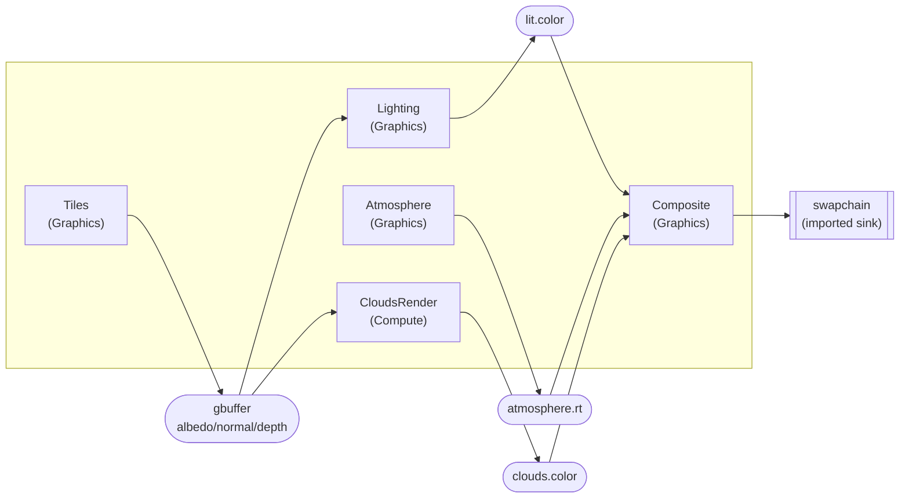
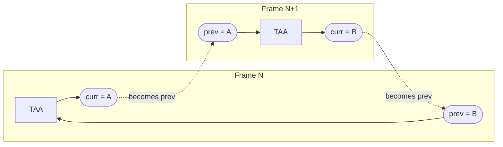
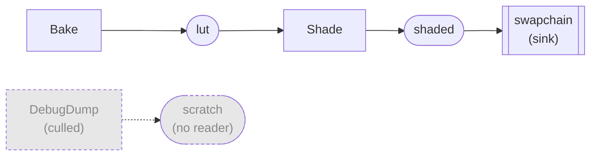

# Render Graph

An immediate-mode frame scheduler for WebGPU (`webgpu/base/RenderGraph.h`, namespace
`webgpu::rg`). Each frame you declare the resources and passes the frame needs. The graph
compiles them into an execution order, manages resource lifetimes, and records the passes into
your command encoder.

The graph owns two things: pass ordering and resource lifetime. It is not a GPU-API wrapper.
Pass bodies call `wgpu*` functions directly.

> The header [`webgpu/base/RenderGraph.h`](../webgpu/base/RenderGraph.h) is the per-call
> reference: every public declaration carries its parameters, defaults, and constraints. This
> document covers how the pieces fit together, with worked examples. It does not restate the
> signatures.

## Contents

- [What it is](#what-it-is)
- [The frame loop](#the-frame-loop)
- [Resources](#resources)
- [Passes](#passes)
- [The two rules](#the-two-rules)
- [Ordering and culling](#ordering-and-culling)
- [Pass groups](#pass-groups)
- [Views and ViewRange](#views-and-viewrange)
- [Buffers](#buffers)
- [Attachments](#attachments)
- [Compute passes](#compute-passes)
- [Transfer passes and copies](#transfer-passes-and-copies)
- [initialize() and hash-gated rebakes](#initialize-and-hash-gated-rebakes)
- [Examples](#examples)
- [Debugging](#debugging)

---

## What it is

Three concepts carry the whole API.

A resource is a GPU texture or buffer the graph knows about. Most resources are transient:
declared fresh every frame, allocated from a pool, and possibly aliased onto the same GPU
memory as another transient whose lifetime does not overlap. External objects such as the
swapchain are imported instead.

A handle is what declaring a resource returns. `ResourceHandle` is a small value type that
names the resource for this frame. Handles are cheap to copy. They are what you pass between
systems and capture into pass lambdas, and they never carry the GPU object itself: the graph
resolves a handle to a real `WGPUTexture` or `WGPUBuffer` only during execution.

Creators return the kind-tagged `TextureHandle` or `BufferHandle`, and the declarations take
those, so handing a buffer to `sampled()` fails to compile rather than tripping an assert. Both
convert to `ResourceHandle` for the calls that accept either, `bind()` among them, but never the
other way round. Store handles in their typed form, and prefer `auto` for locals.

A pass is a unit of GPU work declared with `add_pass`. It names every resource it reads and
writes, and the graph derives ordering from those declarations. A pass whose output nothing
consumes is culled, unless it is marked `force_keep()`.

`add_pass` takes two lambdas, and the split between them is the core of the API. Setup runs
immediately, at record time. It receives a `PassBuilder&` and declares accesses: attachments,
sampled textures, storage buffers, copies. No GPU work happens in setup. Execute runs later,
inside `execute()`, once passes are scheduled and resources are realized. It receives a
`PassContext&` that resolves handles to live GPU objects and holds the encoders. Execute is
where you record draw, dispatch, and copy commands.

### A frame at a glance

A typical deferred frame. Passes (rectangles) declare reads and writes of resources (rounded).
The graph derives every arrow from those declarations. The swapchain is imported, so the pass
that writes it is a sink and cannot be culled.



`Composite` transitively feeds the imported `swapchain`, so every pass above survives culling.
Drop the `Composite -> swapchain` edge, say by making nothing read `lit`, and the whole chain
becomes dead. See [Ordering and culling](#ordering-and-culling).

---

## The frame loop

The call order is a contract. Follow it exactly.

```cpp
// Startup, once:
webgpu::rg::GraphAllocator* allocator = webgpu::rg::create_allocator();

// Every frame:
webgpu::rg::begin_frame(allocator);
webgpu::rg::RenderGraph* rg = webgpu::rg::start_recording(allocator);

// Import the swapchain first if a pass renders to it (imports happen during recording):
auto swapchain = rg->import_texture("swapchain",
    { .view = surface_view, .size = { size.x, size.y, 1 }, .format = surface_format });

// ...declare resources and passes...

// once, after all passes are declared. returns the error chain, and is [[nodiscard]]:
// an unchecked compile() is how a broken frame becomes a silent black screen.
for (auto* e = rg->compile(); e; e = e->next)      // always check. see Debugging.
    qCritical("%.*s", (int)e->message.length, e->message.data);

rg->execute(device, queue, encoder, /*enableProfiling*/ false);
// ...submit the encoder to the queue yourself...
rg->collect_gpu_timings();            // safe always. no-op unless profiling was on.
webgpu::rg::end_frame(allocator);     // after the queue submit

// Shutdown, once:
webgpu::rg::destroy_allocator(allocator);
```

Three ordering constraints cause most of the bugs here:

1. Every `import_*`, `create_*`, and `add_pass` runs before `compile()`. After compile the
   graph is frozen.
2. `end_frame()` runs after you submit the encoder, not before. The graph's pooled objects are
   still referenced by the commands you are submitting.
3. You own the encoder and the submit. The graph records into your encoder and never submits
   for you.

Several graphs per frame are allowed. A later graph may reuse an earlier one's pooled
transients, which assumes the graphs are submitted in execute order on one queue.

---

## Resources

Everything a pass touches must be a graph resource, declared before `compile()`. There are five
kinds. They differ in who owns the GPU object and how long it lives.

| Kind | Lifetime | Create with | Use for |
| --- | --- | --- | --- |
| Transient (default) | this frame | `create_transient_texture` / `_buffer` | intermediate targets, scratch |
| Import | caller-owned | `import_texture` / `import_buffer` | swapchain, objects other systems own |
| History | cross-frame ping-pong | `create_history_texture` / `_buffer` | temporal effects (TAA, reprojection) |
| Persistent | cross-frame, one object | `create_persistent_texture` / `_buffer` | graph-owned caches |
| Initialized | cross-frame, baked once | `create_initialized_texture` / `_buffer` | fallbacks for optional bind slots |

Default to transient. Reach for the others only when you need cross-frame memory.

```cpp
auto rt = rg->create_transient_texture("atmosphere.rt", {
    .dimension = WGPUTextureDimension_2D,
    .format    = WGPUTextureFormat_RGBA8Unorm,
    .absolute  = { w, h, 1 },
});
```

### Relative sizing

`TextureDesc::sizeKind = Relative` sizes a texture at `scaleX` and `scaleY` times the size of
`relativeTo`, so a half-resolution pass tracks its source through window resizes without you
recomputing anything:

```cpp
auto half = rg->create_transient_texture("bloom.half", {
    .dimension  = WGPUTextureDimension_2D,
    .format     = WGPUTextureFormat_RGBA16Float,
    .sizeKind   = webgpu::rg::SizeKind::Relative,
    .scaleX     = 0.5f,
    .scaleY     = 0.5f,
    .relativeTo = fullResColor,
});
```

`relativeTo` may itself be relative. The chain resolves at `compile()`. A cycle is a compile
error, not a hang.

Known limitation: view-format reinterpretation is unsupported. WebGPU needs reinterpret formats
listed at texture creation, and `TextureDesc` does not plumb `viewFormats` yet.

### Transient aliasing

With aliasing on, which is `compile(true)` and the default, two transients pack onto the same
GPU object when their lifetimes do not overlap and their descriptors match (size, format,
dimension, mip and sample count, usage). A transient's lifetime runs from its first write to its
last read. This keeps peak VRAM down.

Overlapping lifetimes never share, even with identical descriptors. `compile(false)` turns
aliasing off, giving every transient its own object. If a bug disappears with aliasing off, a
lifetime was mis-declared, usually an undeclared read or write.

Aliasing stays invisible to correctness as long as your declarations are honest: the graph only
reuses memory it has proven dead. The one thing you must not do is reach around the graph and
cache a transient's `WGPUTexture` or view across passes or frames. The object behind a handle
can be a different, shared one next time. Always resolve inside the pass body via `PassContext`.

### Undeclared reads and aliasing

The `ctx.*` resolvers assert the handle was declared in this pass, so you cannot create an
undeclared read through the intended path: a missing `sampled()` makes `ctx.view()` assert-fail.
The one way past that is to stash a transient's raw view outside the graph and bind it with the
free `webgpu::bind()` (from `gpu_utils.h`) in a later pass that never declares the read:

```cpp
WGPUTextureView m_cached_normal_view = nullptr;   // a transient's view, escaped

auto normal = rg->create_transient_texture("gbuffer.normal", desc);

// Pass A legitimately writes `normal`, then caches its view "to avoid rebuilding":
rg->add_pass("GBuffer", webgpu::rg::PassKind::Graphics,
    [normal](webgpu::rg::PassBuilder& b) { b.color(normal, 0); },
    [this, normal](webgpu::rg::PassContext& c) {
        draw_gbuffer(c);
        m_cached_normal_view = c.view(normal);    // legal here, but now it has escaped the graph
    });

// ...intervening passes declare their own transients. To the graph, `normal` is dead after
//    GBuffer (no later pass declares a read), so the aliaser packs one of them onto its slot...

// Pass B reads `normal` but forgets to declare it, and binds the cached view raw:
rg->add_pass("Lighting", webgpu::rg::PassKind::Graphics,
    [lit](webgpu::rg::PassBuilder& b) {
        b.color(lit, 0);
        // BUG: no b.sampled(normal); the graph never learns Lighting reads `normal`
    },
    [this](webgpu::rg::PassContext& c) {
        webgpu::raii::BindGroup bg(c.device, *m_light_layout,
            { webgpu::bind(0, m_cached_normal_view) },   // raw bind, invisible to hazards and aliasing
            "lighting");
        wgpuRenderPassEncoderSetBindGroup(c.render_pass, 0, bg.handle(), 0, nullptr);
        wgpuRenderPassEncoderDraw(c.render_pass, 3, 1, 0, 0);
    });
```

Under `compile(false)` this looks correct: `normal` keeps its own texture, so the cached view
still points at real data. Under `compile(true)` another transient was packed onto that physical
slot after GBuffer, so the same cached view now reads its pixels. The result is subtly wrong
lighting from identical code, flipped only by aliasing. The fix is to declare the read with
`b.sampled(normal)` and bind it with `c.bind(0, normal)`. Never cache the view.

### Cross-frame pooling

Aliasing packs transients within a frame. The transient pool is separate: it keeps GPU objects
across frames. At `end_frame` a transient's object is returned to the pool rather than
destroyed, and next frame's matching `create_transient_*` gets it back. An object left
unclaimed for `kRetain` (4) frames is destroyed. That idle window is deliberate: a pass that
records on only some frames must not pay a destroy and create every time it skips one.

A resize would defeat that window. The old-size objects are never claimed again, so each one
would linger 4 more frames, and a drag-resize spikes VRAM with a generation per frame. So the
pool also supersede-evicts: at `end_frame`, an idle entry is destroyed immediately if a sibling
created this frame is the same resource at a different size.

"The same resource" is keyed on the resource's interned name, not its descriptor. Two different
transients that merely differ in size look identical to a descriptor-only check, and evicting on
that guess churns without bound: the idle one is destroyed, recreated on its next claim, and
then supersedes the other. That is one destroy plus create every frame, forever, for any
transient not claimed every frame. The name key is what tells a genuine resize apart from a
coincidence.

The asymmetry to remember when touching this: a missed supersede only delays an evict to
`kRetain`, while a false supersede churns. When in doubt the predicate refuses. An entry with no
identity is never superseded.

### History

`create_history_texture` and `create_history_buffer` return a `HistoryTexture` or
`HistoryBuffer`, a pair of handles. Write `.curr`, read `.prev`. This frame's `.curr` becomes next frame's `.prev`. Gate
every read of `.prev` with `ctx.history_valid(history)`, passing the pair itself rather than
either handle. It returns false on the frame the
`.prev` object was recreated and cleared (first use, resize, reset); skip the history sample
then. A non-zero `hash` invalidates the history whenever the hash changes.

The two backing textures ping-pong. Frame N writes buffer A and reads B; frame N+1 writes B and
reads A. The dashed edge is the cross-frame carry the graph tracks for you:



`.prev` is meaningful only when last frame actually wrote `.curr` into the same pool entry. It
is not meaningful on the first frame, the frame after a resize, or any frame the history was
invalidated. In all of these the backing object was just recreated and holds no prior result.
`ctx.history_valid(history)` folds all three cases into one bool. False means skip the temporal
sample this frame and fall back to the non-history path.

```cpp
// TAA: blend with history only when it is valid, otherwise output the fresh sample as-is.
float alpha = c.history_valid(history) ? 0.9f : 0.0f;   // 0 == ignore history
```

Read `.prev` without this gate and the first frame, and every frame after a reset, samples
cleared or uninitialized memory: smeared or black temporal output that clears up after a frame.

### Camera cuts via the history hash

The optional `hash` on `create_history_texture` and `_buffer` is a content-identity stamp. The
graph keeps it with the pool entry. When the hash you pass differs from the stored one, the
entry is destroyed and recreated blank, which drops `history_valid()` to false for that frame,
exactly as a resize would. Pass the same hash and the ping-pong keeps rotating untouched.

This is the mechanism for a camera cut. On a teleport, a projection swap, or any jump where last
frame's pixels no longer correspond to this frame's, reprojection is worse than useless. Feed a
hash that changes on the cut and history self-resets for one frame:

```cpp
// Any value that changes exactly when temporal continuity breaks. The graph only compares it to
// last frame's, so how you derive it is yours: a counter you bump on the cut is enough.
uint64_t cut = cameraCutCounter;
auto taa = rg->create_history_texture("taa.color", desc, cut);
// The frame `cut` changes, history_valid(taa) is false, so skip the reprojected sample.
```

`hash == 0` (the default) disables hash invalidation, so history then resets only on first use
and resize. You do not detect the cut frame yourself and branch: change the hash and let
`history_valid()` report the reset at the read site. This is the same mechanism `initialize()`
uses for gated rebakes. See [initialize() and hash-gated rebakes](#initialize-and-hash-gated-rebakes).

### Initialized fallbacks

`create_initialized_texture` takes a `WGPUColor` fill; `create_initialized_buffer` takes an
optional `data` pointer (null zero-fills). Contents are baked once and reused every frame. This
is the standard fallback for an optional binding slot: when a feature is off, bind a 1x1
initialized texture instead of restructuring the pipeline layout. To bake more complex content
once, such as a LUT computed by a pass, use a persistent resource plus `PassBuilder::initialize()`.
See [initialize() and hash-gated rebakes](#initialize-and-hash-gated-rebakes).

### Import

`import_texture` wraps a GPU object the graph does not own. The caller guarantees it stays alive
for the frame. Imports are never culled: writing an imported resource is an output that leaves
the frame, which is what keeps the chain feeding the swapchain alive.

```cpp
auto swapchain = rg->import_texture("swapchain",
    { .view = surface_view, .size = { size.x, size.y, 1 }, .format = surface_format });
```

Passing the backing `texture` enables the copy family and `ctx.texture()` on this handle, and lets
the graph build views from a declared `ViewRange` as it would for a graph-owned texture. Leaving it
null registers only the view, which restricts the handle to sample and attach, and makes every
subresource selection moot: `ctx.view()` returns the registered view whatever you declared.
`mipCount`, `sampleCount`, and `dimension` default to a single-sample, single-mip 2D texture.
Pass the real values if the source differs. `dimension` is the source texture's own dimension,
so an array or cube source says `2D`.

### Names

Every declaration takes the resource or pass name as a `std::string_view`. The graph hashes it
and copies the name into its arena during the call. The name backs labels, the debug UI, and
error messages; the hash speeds up cross-frame lookups. So the view only has to be valid for
that one call, which is the ordinary `string_view` rule.

```cpp
// Both fine. The argument is alive for the duration of the call:
rg->create_transient_texture("overlay." + std::to_string(i), desc); // temporary lives to the ';'

const std::string name = "overlay." + std::to_string(i);
rg->create_transient_texture(name, desc);                           // named string, obviously alive
```

The only trap is the generic one: do not hand the graph a `string_view` into a string that has
already been destroyed. String literals such as `"clouds.lo_color"` live forever and are always
safe.

---

## Passes

`add_pass(id, kind, setup, execute)` declares one unit of GPU work. The `kind` decides which
encoder the body gets. For `Graphics` you do not call `wgpuCommandEncoderBeginRenderPass`.
`ctx.render_pass` arrives ready, cleared or loaded per your `color()` and `depth_stencil()`
declarations.

```cpp
rg->add_pass("Atmosphere", webgpu::rg::PassKind::Graphics,
    // SETUP: runs now. Declare every resource this pass reads and writes. No GPU work.
    [&](webgpu::rg::PassBuilder& b) {
        b.color(rt, 0);
    },
    // EXECUTE: runs later inside execute(). Record the GPU commands.
    [camera_bg, pipeline = m_pipeline->pipeline().handle()](webgpu::rg::PassContext& ctx) {
        wgpuRenderPassEncoderSetBindGroup(ctx.render_pass, 0, camera_bg, 0, nullptr);
        wgpuRenderPassEncoderSetPipeline(ctx.render_pass, pipeline);
        wgpuRenderPassEncoderDraw(ctx.render_pass, 3, 1, 0, 0);
    });
return rt; // hand the handle to whoever consumes this pass's output
```

### Setup declares, execute records

The split between the two lambdas matters more than any single method.

Setup gets a `PassBuilder&` and declares every resource the pass touches: attachments (`color`,
`depth_stencil`, `resolve`), shader resources (`sampled`, `storage_read`, `storage_write`,
`storage_read_write`, `uniform`, `host_write`), buffer inputs (`vertex_buffer`, `index_buffer`,
`indirect_buffer`), and copies. Those declarations are the only thing the graph knows about the
pass. It derives ordering from them, infers usage flags from them, and decides aliasing from
them. Setup does no GPU work.

Two builder calls declare no access but change scheduling. `initialize(target, hash)` gates the
pass on a bake being stale (see [initialize()](#initialize-and-hash-gated-rebakes)), and
`force_keep()` exempts it from culling (see [Ordering and culling](#ordering-and-culling)).

Execute gets a `PassContext&` and records commands. Its resolvers (`ctx.view`, `ctx.bind`,
`ctx.texture`, `ctx.buffer`, the sizes and formats, the copy infos) each assert the handle was
declared in this pass. That assert stops most undeclared reads at the door. The one path around
it is [Undeclared reads and aliasing](#undeclared-reads-and-aliasing).

For the per-call reference, every parameter, default, and constraint, read
[`webgpu/base/RenderGraph.h`](../webgpu/base/RenderGraph.h). It is the source of truth and is
commented for that purpose. This document does not restate it.

---

## The two rules

Break either one and you get a compile error, a crash, or silently wrong pixels.

### Rule 1: the execute lambda must be trivially destructible

Its closure is stored in an arena that frees memory without running destructors. A
`static_assert` in `add_pass` enforces this. Capture handles, raw GPU handles (`WGPUBindGroup`,
`WGPURenderPipeline`), plain values, and `this` by value. Never capture a `std::string`, smart
pointer, container, or RAII wrapper.

```cpp
// OK: raw handle pulled out at declaration time.
[pipeline = m_pipeline->pipeline().handle()](webgpu::rg::PassContext& ctx) { ... }
// Compile error: std::string is not trivially destructible.
[label = std::string("debug")](webgpu::rg::PassContext& ctx) { ... }
```

### Rule 2: never pre-build a bind group over a transient's view

A transient's real GPU texture is not chosen until `execute()`, and it can change frame to frame
through pooling and aliasing. A bind group built outside the pass body points at stale or wrong
memory. Build bind groups inside the execute lambda, as a body-local `webgpu::raii::BindGroup`,
from `ctx.bind(...)` entries:

```cpp
[this, result](webgpu::rg::PassContext& c) {
    webgpu::raii::BindGroup bg(c.device, *m_layout, {
        c.bind(0, result),                     // graph resource -> ctx.bind
        m_ubo->create_bind_group_entry(1),     // app-owned static -> its own helper
    }, "blit");
    wgpuRenderPassEncoderSetBindGroup(c.render_pass, 0, bg.handle(), 0, nullptr);
    wgpuRenderPassEncoderDraw(c.render_pass, 3, 1, 0, 0);
}
```

The body-local group is safe to destroy at end of scope. The encoder keeps its own reference
once `SetBindGroup` records it.

The same rule forbids caching a transient's view to bind raw in a later pass. That read is
undeclared, so the aliaser can hand its memory to another transient and the cached view reads
the wrong pixels, a bug that shows only with aliasing on. See
[Undeclared reads and aliasing](#undeclared-reads-and-aliasing) and the `compile(false)` row in
[Troubleshooting](#troubleshooting).

Mixing rule: any resource a graph pass touches binds with `ctx.bind(handle)`, so the graph can
order and alias it. A static or externally-synced object, such as a static UBO or a shadow map
the app owns, binds with its own `create_bind_group_entry()` or the free `webgpu::bind()`
overloads (in `webgpu/base/gpu_utils.h`):

```cpp
WGPUBindGroupEntry bind(uint32_t binding, WGPUTextureView view);
WGPUBindGroupEntry bind(uint32_t binding, WGPUSampler sampler);
WGPUBindGroupEntry bind(uint32_t binding, WGPUBuffer buffer, uint64_t offset, uint64_t size);
```

---

## Ordering and culling

You never write dependencies by hand. The graph derives order from your access declarations: a
`sampled(x)` runs after whatever `color(x)` or `storage_write(x)` produced `x`. To chain two
passes, write a fresh transient in the producer, capture the handle, and declare it as a read in
the consumer:

```cpp
auto out = producer(rg);          // returns a handle it wrote
consumer(rg, /*reads*/ out);      // declares b.sampled(out) -> ordered after producer
```

Read-after-write and write-after-write both become ordering edges. Write-after-write keeps
declaration order. Declare the producing pass before its readers, def before use.

Below, `Bake` writes `lut` and `Shade` reads it: one edge, one order. `DebugDump` writes only a
plain transient nobody reads, so it never reaches a sink and `compile()` drops it (dashed):



To keep `DebugDump` (readback, indirect-arg generation, a bake nobody reads this frame), mark it
`force_keep()` or gate it with `initialize()`.

`compile()` drops every pass whose output nothing needs. A pass is kept only if it transitively
feeds a sink:

| Sink | Why it counts |
| --- | --- |
| A read by another surviving pass | ordinary producer/consumer dependency |
| A write to an imported resource | the value leaves the frame (e.g. the swapchain) |
| A write to a history `.curr` | it becomes next frame's `.prev` |
| A `force_keep()` pass | explicit side-effect root |

A pass that only writes a plain transient nobody reads is dead and silently culled. It leaves
the debug panel and GPU timings. If your pass has a side effect the graph cannot see (readback,
indirect-arg generation, a bake nobody reads this frame), mark it `force_keep()` or gate it with
`initialize()`.

---

## Pass groups

A `.` in a pass name creates a group. The span before the first dot is the group name, and
passes that share it are bracketed together in GPU captures and drawn as one region in the
RenderGraph panel. Naming costs nothing and makes a 40-pass frame readable.

```cpp
rg->add_pass("bloom.threshold", ...);
rg->add_pass("bloom.blurH",     ...);
rg->add_pass("bloom.blurV",     ...);
rg->add_pass("bloom.composite", ...);
```

Grouping is a labelling feature only. It has no effect on ordering, culling, aliasing, usage
inference, or correctness. A pass with no dot in its name belongs to no group.

### What the group drives

During `execute()`, the graph brackets each run of same-group passes in a command-encoder debug
group with `wgpuCommandEncoderPushDebugGroup` and `PopDebugGroup`. A RenderDoc, PIX, or Xcode
capture then shows `bloom` as one collapsible region containing its four passes instead of four
unrelated entries.

The panel uses the same prefix to draw the run inside one bordered region and to keep it as a
single block in the layout, so a group stays visually together instead of being scattered by the
dependency columns. A region needs at least two passes; a lone `bloom.threshold` draws as an
ordinary box.

### Nesting with more dots

The encoder debug group uses the first segment only. The panel goes further and builds a tree
from the remaining segments, so `bloom.down.0` and `bloom.down.1` nest under `bloom.down`, which
nests under `bloom`. Each level collapses independently and the panel remembers the collapse
state per prefix across frames.

```cpp
rg->add_pass("bloom.down.0", ...);   // panel: bloom > down > 0
rg->add_pass("bloom.down.1", ...);
rg->add_pass("bloom.up.0",   ...);   // panel: bloom > up > 0
```

As with the top level, a nested level needs at least two members to become its own subgroup.

### Groups follow execution order, not declaration order

The run is computed over passes in execution order, which `compile()` derives from your
declarations. Passes sharing a prefix that do not end up scheduled next to each other produce
two separate debug groups with the same name, not one merged region.

This is usually invisible, because a group is normally a chain and a chain schedules
consecutively. It shows up when an unrelated pass gets scheduled into the middle of a group, for
example when a group member reads a resource produced late. If a group looks split in a capture,
check the Graph tab for what landed between its members.

Culling applies first. A culled pass is not in the execution order at all, so it contributes
nothing to its group, and a group whose members are all culled disappears.

By convention resource names use dots too, as in `gbuffer.albedo` and `clouds.lo_color`. That is
for readability in labels and error messages. Only pass names form groups.

---

## Views and ViewRange

`ctx.view(h)` returns a view whose shape matches what you declared: same base mip and layer,
same `ViewRange`. You never build a `WGPUTextureViewDescriptor`.

Which subresource you mean is part of the same option struct as everything else. `sampled()` and
the `storage_*()` family take a `ViewRange`, whose `baseMip`/`baseLayer` default to 0. Attachments
and copies take a `Subresource` instead, since they address exactly one mip and one layer.

```cpp
b.sampled(tex, { .baseMip = 2 });                                      // read mip 2
b.color(tex, 0, { .sub = { .mip = 3 } });                              // render into mip 3
// In the body, fetch a specific subresource explicitly:
WGPUTextureView mip2 = c.view(tex, 2);        // mip 2, layer 0
auto entry           = c.bind(0, tex, 2);     // same view, as a bind-group entry
```

`ViewRange` is how you name more than one subresource: a mip chain, an array slice, a cubemap,
or a single aspect of a depth-stencil texture. It is the optional last argument of `sampled()`
and the `storage_*()` family. Attachments take a `Subresource` instead, since a render target is
always one mip and one layer.

Write it with designated initializers. The fields are same-typed, so a positional
`{ 1, 2, 0, 6 }` compiles happily while meaning something else entirely. The `cube()`,
`cube_array()` and `whole()` helpers return a ready-made range, and `.at(mip, layer)` rebases
one: `cube().at(0, 4)` is cube face 4. The shape you declare here is the shape `ctx.view(h)` hands back in the body.

### The default is one subresource

Every field has a default that suits a plain 2D texture, so `{}` (what you get by omitting it)
means one mip, one layer, all aspects, dimension inferred. Set a field only when that is not
what you want.

### mipCount and layerCount count forward, and 0 means the rest

Both are counts from the base, not indices. `b.sampled(tex, { .baseMip = 2, .mipCount = 3 })` is mips 2,
3, and 4.

`0` is the useful special case: all remaining from the base. Prefer it to counting by hand. An
over-wide count is the usual cause of a `"declares a view of …"` compile error, and `0` cannot
overrun.

```cpp
b.sampled(prefiltered, { .mipCount = 0 });              // the whole mip chain
b.sampled(cascades,    { .layerCount = 4 });            // layers 0..3, as a 2DArray
b.sampled(cascades,    { .baseLayer = 2, .layerCount = 0 }); // layer 2 to the end
```

### dim is inferred unless you set it

`dim` defaults to `Undefined`, which resolves to `3D` for a 3D texture, else `2DArray` when the
view covers more than one layer, else `2D`. That is right nearly always. Set it explicitly for a
cube, or to force `2DArray` over a single layer because the shader binding says
`texture_2d_array`.

### aspect picks a plane

For a combined depth-stencil format, say which plane a sampled read means:

```cpp
b.sampled(depth, { .aspect = WGPUTextureAspect_DepthOnly });
```

### Layers come from the texture, not the range

`layerCount` can only slice layers the texture actually has, and array layers live in
`TextureDesc::absolute.depthOrArrayLayers` of a 2D texture. An array is 2D with depth > 1, not
`WGPUTextureDimension_3D`. Confuse the two and you get a `3D` view where you wanted an array, or
a range error:

```cpp
auto cascades = rg->create_transient_texture("shadow.cascades", {
    .dimension = WGPUTextureDimension_2D,          // 2D, not 3D
    .format    = WGPUTextureFormat_Depth32Float,
    .absolute  = { 2048, 2048, /*layers*/ 4 },     // the layer count lives here
});
b.sampled(cascades, { .layerCount = 4 });    // -> 2DArray of 4
```

### Cubes: use the helpers

Cube views have strict rules: exactly 6 layers, a positive multiple of 6 for an array, and a 2D
source. Three constexpr helpers spell them out correctly. `whole()` is the everything-from-the-
base shorthand:

```cpp
b.sampled(envMap,      webgpu::rg::cube());        // 6 layers, dim Cube
b.sampled(probes,      webgpu::rg::cube_array(4)); // 4 cubes = 24 layers
b.sampled(prefiltered, webgpu::rg::whole());       // every mip and layer
// each helper also takes an aspect and a mipCount:
b.sampled(envMap, webgpu::rg::cube(WGPUTextureAspect_All, /*mipCount*/ 0)); // cube + full chain
```

`compile()` checks the rest and names the offending pass and resource: a cube covering other
than 6 layers, a cube array not a multiple of 6, a base plus count past the last layer, or a
cube view of a non-2D texture. One rule has no workaround: a cube view on a `storage_read` or
`storage_write` is an error, because WebGPU storage textures cannot be cube. Sample it as a
cube, or bind it as a `2DArray` for storage.

### Recipe: generate a mip chain

A copy cannot resize, so mip generation is a blit pass per level: sample mip `i`, render into
mip `i+1`, same handle, two subresources. Hazard tracking is whole-resource, so the chain
serializes level by level, which is the order you want anyway.

The texture must be created with the levels it is about to fill. `TextureDesc::mipLevelCount`
defaults to 1 and there is no `0` meaning all, so spell the chain out; a loop past the declared
count is the `"is accessed at mip …"` compile error:

```cpp
constexpr uint32_t kMips = 8;
auto tex = rg->create_transient_texture("prefiltered", {
    .dimension     = WGPUTextureDimension_2D,
    .format        = WGPUTextureFormat_RGBA16Float,
    .absolute      = { 256, 256, 1 },
    .mipLevelCount = kMips,          // without this the texture has one mip
});

for (uint32_t mip = 1; mip < kMips; ++mip) {
    rg->add_pass(names[mip], webgpu::rg::PassKind::Graphics, // names[] must outlive each add_pass call
        [&](webgpu::rg::PassBuilder& b) {
            b.sampled(tex, { .baseMip = mip - 1 });     // read mip i-1
            b.color(tex, 0, { .sub = { .mip = mip } });  // write mip i
        },
        [tex, mip, layout = m_blitLayout.handle()](webgpu::rg::PassContext& c) {
            webgpu::raii::BindGroup group(c.device, layout, { c.bind(0, tex, mip - 1) }, "mip blit");
            wgpuRenderPassEncoderSetBindGroup(c.render_pass, 0, group.handle(), 0, nullptr);
            wgpuRenderPassEncoderDraw(c.render_pass, 3, 1, 0, 0);
        });
}
```

---

## Buffers

Declare buffers with `create_transient_buffer`, `create_persistent_buffer`, or
`create_history_buffer`, each taking a `BufferDesc { size }`. `import_buffer` takes the caller's
`WGPUBuffer` instead of a desc, since the object already has its size. Usage flags are inferred
from how passes declare the buffer. You never set `WGPUBufferUsage` yourself:

| Declaration | Inferred usage | WGSL |
| --- | --- | --- |
| `b.uniform(h)` | Uniform | `var<uniform>` |
| `b.storage_read(h)` | Storage (read) | `var<storage, read>` |
| `b.storage_write(h)` / `b.storage_read_write(h)` | Storage (write / read_write) | `var<storage, read_write>` |
| `b.vertex_buffer(h)` | Vertex | vertex fetch |
| `b.index_buffer(h)` | Index | index fetch |
| `b.indirect_buffer(h)` | Indirect | draw/dispatch indirect args |
| `b.host_write(h)` | CopyDst | filled via `wgpuQueueWriteBuffer` in the body |
| `b.copy_buffer(src,dst,…)` | CopySrc / CopyDst | see copies |

`ctx.buffer(h)` gives the `WGPUBuffer`, and `ctx.buffer_size(h)` its realized size.
`ctx.bind(binding, h)` makes a whole-buffer binding at offset 0 with the realized size, unless the
declaration carried a `BufferRange` (below).

### Binding a sub-range

`uniform()` and the `storage_*()` buffer declarations take an optional `BufferRange { offset, size }`,
the buffer analog of `ViewRange`: the shape you declare is the shape `ctx.bind(binding, h)` hands
back. `size = 0` (the default) means all remaining bytes from `offset`, resolved at declare time.

```cpp
// bind the second 256-byte slice of a packed parameter buffer
b.uniform(params, { .offset = 256, .size = 256 });
b.storage_read(packed, { .offset = 512 });   // byte 512 to the end
```

Constraints, all checked at `compile()`: the range must fit the buffer, must not be empty, and
`offset` must be a multiple of 256, the spec-default uniform/storage offset alignment. One range per
buffer per pass; two bind declarations giving the same buffer different ranges is ambiguous and
asserts in `ctx.bind`. Hazard tracking stays whole-resource, so two passes touching disjoint ranges
of one buffer still order serially; use separate transients if that matters.

```cpp
auto args = rg->create_transient_buffer("cull.args", { .size = 16 });

rg->add_pass("Cull", webgpu::rg::PassKind::Compute,
    [args, ids](webgpu::rg::PassBuilder& b) {
        b.storage_read(ids);
        b.storage_write(args);      // -> Storage usage on args
    },
    [this, args, ids](webgpu::rg::PassContext& c) {
        webgpu::raii::BindGroup bg(c.device, *m_cull_layout,
            { c.bind(0, ids), c.bind(1, args) }, "cull");
        wgpuComputePassEncoderSetPipeline(c.compute_pass, m_cull_pipeline);
        wgpuComputePassEncoderSetBindGroup(c.compute_pass, 0, bg.handle(), 0, nullptr);
        wgpuComputePassEncoderDispatchWorkgroups(c.compute_pass, groups, 1, 1);
    });
// A later Graphics pass declares b.indirect_buffer(args) -> args gains Indirect usage
// and the draw is ordered after Cull.
```

---

## Attachments

The graph schedules passes and wires attachments. The pass body owns the pipeline (blend,
depth-stencil state, `multisample.count`). The graph does not validate formats; Dawn does.

### Color and depth

`color()` and `depth_stencil()` declare a write into one subresource (a render target is always
one mip, one layer). Their load and store ops are plain WebGPU, passed through untouched: `Clear`
starts from the clear value, `Load` keeps what is there, `Store` keeps the result, `Discard`
throws it away.

`color()` takes the attachment slot explicitly, right after the handle. It is the `@location`
the fragment shader writes, not the order you declare in. Slots may be sparse, but one slot
twice in a pass is an error.

```cpp
// Slot 0, clear to opaque black, keep the result:
b.color(target, 0);                                           // defaults: Clear, Store, {0,0,0,1}
// Draw over what a previous pass produced (composite, overlays, tracks):
b.color(target, 0, { .load = WGPULoadOp_Load });
// Depth attachment, reverse-Z: clear to 0.0 and pair with a Greater/GreaterEqual pipeline.
b.depth_stencil(depth, { .clearDepth = 0.0f });
```

A multi-target pass names one slot per `color()`, matching its fragment shader's `@location`s,
plus an optional `depth_stencil()`:

```cpp
rg->add_pass("Tiles", webgpu::rg::PassKind::Graphics,
    [albedo, position, normal, gdepth](webgpu::rg::PassBuilder& b) {
        b.color(albedo,   0, { .clear = { 0, 0, 0, 0 } });
        b.color(position, 1, { .clear = { 0, 0, 0, 0 } });
        b.color(normal,   2, { .clear = { 0, 0, 0, 0 } });
        b.depth_stencil(gdepth, { .clearDepth = 0.0f }); // reverse-Z
    },
    [this](webgpu::rg::PassContext& c) { /* set bind groups + pipeline; draw */ });
```

Up to 8 color attachments (`kMaxColorAttachments`). A test-only pass that reads depth without
writing it declares `depth_stencil_read_only(depth)`, the cheapest way to avoid a false write
hazard.

### MSAA and resolve

`TextureDesc::sampleCount = 4` makes a texture multisampled (WebGPU 1.0 allows 1 or 4). MSAA and
non-MSAA textures never alias each other.

`resolve(src, target)` declares `target` as the single-sample resolve of `src`. The `src` handle
must already have a `color()` declaration in this pass, or you get an error naming the pass. Each
color attachment takes at most one resolve target.

```cpp
auto msaaColor = rg->create_transient_texture("msaa.color",
    { .dimension = WGPUTextureDimension_2D, .format = kColorFormat, .absolute = size, .sampleCount = 4 });
auto msaaDepth = rg->create_transient_texture("msaa.depth",
    { .dimension = WGPUTextureDimension_2D, .format = WGPUTextureFormat_Depth32Float, .absolute = size, .sampleCount = 4 });
auto resolved  = rg->create_transient_texture("resolved",
    { .dimension = WGPUTextureDimension_2D, .format = kColorFormat, .absolute = size }); // single-sample

rg->add_pass("forward.msaa", webgpu::rg::PassKind::Graphics,
    [&](webgpu::rg::PassBuilder& b) {
        b.color(msaaColor, 0);              // multisample color
        b.resolve(msaaColor, resolved);     // src must already be declared as a color()
        b.depth_stencil(msaaDepth);         // depth is NOT resolved
    },
    [pipeline = msaaPipe](webgpu::rg::PassContext& ctx) {
        // pipeline MUST be built with .multisample = { .count = 4, .mask = ~0u }
        wgpuRenderPassEncoderSetPipeline(ctx.render_pass, pipeline);
        wgpuRenderPassEncoderDraw(ctx.render_pass, 3, 1, 0, 0);
    });
```

The resolve target may be an imported texture, resolving straight into the swapchain:
`b.resolve(msaaColor, swapchain)`. Dawn enforces the rest: every attachment in one pass shares
one `sampleCount` equal to the pipeline's; a resolve target is single-sample with the same
format and size as its color; depth and stencil cannot be resolved through a render pass.

### Stencil

Use a depth+stencil format (`Depth24PlusStencil8`, `Depth32FloatStencil8`) and pass the stencil
load, store, and clear to `depth_stencil()`. The graph only carries the attachment's load, store,
and clear. The actual stencil compare and write live in the pipeline's `WGPUDepthStencilState`.
The stencil params default to `Undefined`, so depth-only formats are unaffected; leave them out.

```cpp
// Pass 1: write the mask (pipeline: stencil passOp = Replace, ref = 1).
b.depth_stencil(ds, { .stencilLoad = WGPULoadOp_Clear, .stencilStore = WGPUStoreOp_Store });
// Pass 2: effect only where stencil == 1 (pipeline: compare = Equal, ref = 1).
b.depth_stencil_read_only(ds); // test only -> reads ds, orders after the mask pass
b.color(outColor, 0, { .load = WGPULoadOp_Load });
```

`depth_stencil_read_only()` marks both depth and stencil read-only. Marking stencil read-only
while depth stays writable is not expressible; they share one flag.

---

## Compute passes

`PassKind::Compute` gives you `ctx.compute_pass`. Declare storage, sampled, and uniform accesses
in setup; build the bind group in the body from `ctx.bind(...)` and dispatch. A pass that writes
a storage target and a later pass that samples it are ordered automatically.

```cpp
rg->add_pass("CloudsRender", webgpu::rg::PassKind::Compute,
    [lo_color, lo_depth, gbuffer_depth](webgpu::rg::PassBuilder& b) {
        b.storage_write(lo_color);   // binding 4 (rgba16float)
        b.storage_write(lo_depth);   // binding 5 (r32float)
        b.sampled(gbuffer_depth);    // ordering only: bound via a pre-built depth bind group
    },
    [this, lo_color, lo_depth, depth_bg, shared_config_bg](webgpu::rg::PassContext& c) {
        webgpu::raii::BindGroup bind_group(c.device,
            m_ctx->resource_registry().bind_group_layout("render_clouds"),
            {
                m_params_ubo->raw_buffer().create_bind_group_entry(0),  // static
                m_atlas_view->create_bind_group_entry(1),               // static
                c.bind(4, lo_color),                                    // graph storage-write
                c.bind(5, lo_depth),
            }, "CloudsRender");
        wgpuComputePassEncoderSetPipeline(c.compute_pass, m_render_pipeline->handle());
        wgpuComputePassEncoderSetBindGroup(c.compute_pass, 0, bind_group.handle(), 0, nullptr);
        wgpuComputePassEncoderSetBindGroup(c.compute_pass, 1, depth_bg, 0, nullptr);
        wgpuComputePassEncoderSetBindGroup(c.compute_pass, 2, shared_config_bg, 0, nullptr);
        wgpuComputePassEncoderDispatchWorkgroups(c.compute_pass,
            ceil_div(res.x, 8u), ceil_div(res.y, 8u), 1);
    });
```

Storage and sampled transitions between compute passes, and between compute and graphics, are
auto-synchronized by Dawn. There are no manual barriers. A read and write in the same dispatch
uses `storage_read_write()`; in-dispatch races are the shader's responsibility.

---

## Transfer passes and copies

`PassKind::Transfer` gets no pass object. The body encodes copies directly on `ctx.encoder`.
Each copy method declares `CopySrc` on src and `CopyDst` on dst, and the ctx resolvers build the
WebGPU copy descriptors with the declared subresource applied.

Four copies are declarable: `copy_texture` (subresource to subresource, it cannot resize, so it
is no use for mip generation), `copy_texture_to_buffer` (readback and export),
`copy_buffer_to_texture` (host-staged upload), and `copy_buffer` (a byte range; offsets and size
must be multiples of 4, and src and dst must differ).

Resolvers give you one unambiguous handle and direction per pass. For several copies over one
resource, build the infos by hand via `ctx.texture()` and `ctx.buffer()`.

```cpp
// Buffer -> buffer (e.g. counter -> indirect args):
rg->add_pass("CopyArgs", webgpu::rg::PassKind::Transfer,
    [counter, indirectArgs](webgpu::rg::PassBuilder& b) {
        b.copy_buffer(counter, indirectArgs, 0, 0, 16);
    },
    [counter, indirectArgs](webgpu::rg::PassContext& ctx) {
        auto c = ctx.buffer_copy_info(counter, indirectArgs);   // size already expanded
        wgpuCommandEncoderCopyBufferToBuffer(ctx.encoder, c.src, c.srcOffset, c.dst, c.dstOffset, c.size);
    });
```

The buffer side of a texture copy is yours to describe, and WebGPU requires each row to start on
a 256-byte boundary. `webgpu::rg::aligned_bytes_per_row(widthTexels, texelBlockBytes)` does that
rounding so the readback buffer and the layout agree:

```cpp
// Texture -> buffer readback. The buffer-side layout is the body's; rows are 256-aligned.
rg->add_pass("Readback", webgpu::rg::PassKind::Transfer,
    [src, dst](webgpu::rg::PassBuilder& b) { b.copy_texture_to_buffer(src, dst); },
    [src, dst, w, h](webgpu::rg::PassContext& ctx) {
        WGPUTexelCopyBufferLayout layout {
            .offset = 0,
            .bytesPerRow  = webgpu::rg::aligned_bytes_per_row(w, /*texelBytes*/ 4),
            .rowsPerImage = h,
        };
        auto s  = ctx.copy_src_info(src);          // texture side, declared mip/layer applied
        auto d  = ctx.copy_dst_buffer(dst, layout); // buffer side, {layout, buffer}
        auto sz = ctx.copy_extent_src(src);
        wgpuCommandEncoderCopyTextureToBuffer(ctx.encoder, &s, &d, &sz);
    });
```

Hazard tracking is whole-resource: two copies over disjoint ranges of the same pair still order
serially. Copying an imported texture requires that the import passed its backing `WGPUTexture`.
Copies are not auto-encoded in `execute()`; the body calls `wgpu*` directly, the same contract
as every other pass kind.

---

## initialize() and hash-gated rebakes

`initialize()` marks a pass as the baker for a pool-backed resource: a persistent texture or
buffer, or a history `.curr`. You still declare the write normally (`color()`, `storage_write()`,
a copy). `initialize()` only decides whether the pass runs this frame. The graph runs it only
when the target needs rebaking, and skips it, culling the pass so it leaves the panel and
timings, on every frame the baked content is still valid. Readers bind the pooled result either
way: persistent resources are external to the frame, so no in-graph writer is required for a
reader to resolve them.

Declare it in setup, alongside the write it gates:

```cpp
// Bake a BRDF or atmosphere LUT once, then reuse the pooled texture every frame.
auto lut = rg->create_persistent_texture("brdf.lut", lutDesc);

rg->add_pass("BakeBRDF", webgpu::rg::PassKind::Compute,
    [lut](webgpu::rg::PassBuilder& b) {
        b.storage_write(lut);   // the actual write
        b.initialize(lut);      // hash 0 -> bake once, then skip forever
    },
    [this, lut](webgpu::rg::PassContext& c) { /* dispatch the bake */ });
// Every later frame: BakeBRDF is skipped and culled; samplers still bind the pooled LUT.
```

### The rebake triggers

A pass gated by `initialize(target, hash)` runs when any of these holds; otherwise it is skipped
and culled:

| Trigger | Meaning |
| --- | --- |
| First frame | the pool entry has never been realized or baked |
| Pool recreation | the entry was evicted, or resized or reformatted (a bigger usage set, a size/format/dim/mip/sample change). Recreation clears the baked flag |
| Hash mismatch | the `hash` you pass differs from the one stamped at the last bake |

A body bakes all its targets or none: one stale target re-arms the whole pass. The hash is
re-stamped when the pass actually runs, during `execute()`, so a frame that fails `compile()`
never claims a bake it did not perform.

### Ad-hoc rebuilding via the hash

`hash == 0` means bake once, never again. A non-zero hash turns `initialize()` into an on-demand
rebuild: pass a value derived from every input the baked content depends on, and the bake re-runs
exactly on the frames that value changes. There is no dirty flag, no manual invalidation call,
and no rebuild every frame.

```cpp
// Rebake only when a setting that feeds the LUT changes. Any hash over those inputs works, the
// graph just compares it to the value stamped at the last bake:
uint64_t sig = std::hash<std::string_view> {}(
    { reinterpret_cast<const char*>(&lutParams), sizeof(lutParams) });  // explicit size, not strlen

rg->add_pass("BakeBRDF", webgpu::rg::PassKind::Compute,
    [lut, sig](webgpu::rg::PassBuilder& b) {
        b.storage_write(lut);
        b.initialize(lut, sig);   // re-runs only on the frame `sig` changes
    },
    [this, lut](webgpu::rg::PassContext& c) { /* dispatch the bake */ });
```

This is the same hash mechanism history uses for
[camera cuts](#camera-cuts-via-the-history-hash): one number, changed when the content's
identity changes, and the graph rebuilds on that frame. Use it for LUTs that depend on tunables,
precomputed shadow or irradiance data keyed to sun direction, and any expensive result whose
inputs change occasionally but not per frame.

---

## Examples

Each example is a small slice of a real frame graph. They compose the pieces from the sections
above: MRT attachments, cross-stage ordering, relative sizing, history, persistent bakes, and
imports. The pass bodies are abbreviated to the graph-relevant calls; pipeline creation and
draw setup live in the app.

### Deferred shading: G-buffer plus compute lighting

A Graphics pass fills a multi-target G-buffer. A Compute pass reads the three targets and writes
a lit storage texture. The read-after-write edge is derived from the declarations, so the compute
pass runs after the G-buffer with no manual barrier.

```cpp
auto albedo = rg->create_transient_texture("gbuffer.albedo",
    { .dimension = WGPUTextureDimension_2D, .format = WGPUTextureFormat_RGBA8Unorm,  .absolute = size });
auto normal = rg->create_transient_texture("gbuffer.normal",
    { .dimension = WGPUTextureDimension_2D, .format = WGPUTextureFormat_RGBA16Float, .absolute = size });
auto depth  = rg->create_transient_texture("gbuffer.depth",
    { .dimension = WGPUTextureDimension_2D, .format = WGPUTextureFormat_Depth32Float, .absolute = size });
auto lit    = rg->create_transient_texture("lit.color",
    { .dimension = WGPUTextureDimension_2D, .format = WGPUTextureFormat_RGBA16Float, .absolute = size });

rg->add_pass("GBuffer", webgpu::rg::PassKind::Graphics,
    [albedo, normal, depth](webgpu::rg::PassBuilder& b) {
        b.color(albedo, 0, { .clear = { 0, 0, 0, 0 } });
        b.color(normal, 1, { .clear = { 0, 0, 0, 0 } });
        b.depth_stencil(depth, { .clearDepth = 0.0f }); // reverse-Z
    },
    [this](webgpu::rg::PassContext& c) { draw_scene(c); });

rg->add_pass("Lighting", webgpu::rg::PassKind::Compute,
    [albedo, normal, depth, lit](webgpu::rg::PassBuilder& b) {
        b.sampled(albedo);
        b.sampled(normal);
        b.sampled(depth);         // depth-only format, so no aspect needed
        b.storage_write(lit);     // ordered after GBuffer by the reads above
    },
    [this, albedo, normal, depth, lit, lights_bg](webgpu::rg::PassContext& c) {
        webgpu::raii::BindGroup bg(c.device, *m_light_layout, {
            c.bind(0, albedo), c.bind(1, normal), c.bind(2, depth), c.bind(3, lit),
        }, "tiled-lighting");
        wgpuComputePassEncoderSetPipeline(c.compute_pass, m_light_pipeline);
        wgpuComputePassEncoderSetBindGroup(c.compute_pass, 0, bg.handle(), 0, nullptr);
        wgpuComputePassEncoderSetBindGroup(c.compute_pass, 1, lights_bg, 0, nullptr); // app-owned light list
        wgpuComputePassEncoderDispatchWorkgroups(c.compute_pass,
            ceil_div(size.width, 16u), ceil_div(size.height, 16u), 1); // one workgroup per 16x16 tile
    });
// return `lit` to the tonemap/composite pass.
```

For a tiled light culling prepass, add a `create_transient_buffer` for the per-tile light index
list, `storage_write` it in a cull compute pass, and `storage_read` it here. The cull pass then
orders before lighting.

### Bloom: relative-sized downsample chain

The bright-pass and blur targets are half resolution, sized with `Relative` so they follow the
HDR target through resizes. The chain is a sequence of transients, each written by one pass and
read by the next. The final composite loads the HDR target and adds the blurred bloom on top.

```cpp
webgpu::rg::TextureDesc halfDesc {
    .dimension  = WGPUTextureDimension_2D,
    .format     = WGPUTextureFormat_RGBA16Float,
    .sizeKind   = webgpu::rg::SizeKind::Relative,
    .scaleX = 0.5f, .scaleY = 0.5f,
    .relativeTo = hdrColor,
};
auto bright = rg->create_transient_texture("bloom.bright", halfDesc);
auto blurH  = rg->create_transient_texture("bloom.blur_h", halfDesc);
auto blurV  = rg->create_transient_texture("bloom.blur_v", halfDesc);

// A tiny helper: full-screen pass that samples one texture and writes another.
auto blit_pass = [&](const char* name, webgpu::rg::TextureHandle src,
                     webgpu::rg::TextureHandle dst, WGPURenderPipeline pipe) {
    rg->add_pass(name, webgpu::rg::PassKind::Graphics,
        [src, dst](webgpu::rg::PassBuilder& b) { b.sampled(src); b.color(dst, 0); },
        [this, src, pipe](webgpu::rg::PassContext& c) {
            webgpu::raii::BindGroup bg(c.device, *m_blit_layout, { c.bind(0, src) }, "bloom");
            wgpuRenderPassEncoderSetPipeline(c.render_pass, pipe);
            wgpuRenderPassEncoderSetBindGroup(c.render_pass, 0, bg.handle(), 0, nullptr);
            wgpuRenderPassEncoderDraw(c.render_pass, 3, 1, 0, 0);
        });
};

blit_pass("bloom.threshold", hdrColor, bright, m_threshold_pipe);
blit_pass("bloom.blurH",     bright,   blurH,  m_blur_h_pipe);
blit_pass("bloom.blurV",     blurH,    blurV,  m_blur_v_pipe);

// Composite: keep the HDR target, add bloom. Additive blend lives in m_add_pipe.
rg->add_pass("bloom.composite", webgpu::rg::PassKind::Graphics,
    [hdrColor, blurV](webgpu::rg::PassBuilder& b) {
        b.color(hdrColor, 0, { .load = WGPULoadOp_Load }); // load, do not clear
        b.sampled(blurV);
    },
    [this, blurV](webgpu::rg::PassContext& c) {
        webgpu::raii::BindGroup bg(c.device, *m_blit_layout, { c.bind(0, blurV) }, "bloom.add");
        wgpuRenderPassEncoderSetPipeline(c.render_pass, m_add_pipe);
        wgpuRenderPassEncoderSetBindGroup(c.render_pass, 0, bg.handle(), 0, nullptr);
        wgpuRenderPassEncoderDraw(c.render_pass, 3, 1, 0, 0);
    });
```

`bright` is dead after `bloom.blurH` reads it, so the aliaser can pack `blurV` onto the same
memory. The three half-res targets cost one or two physical textures, not three.

### TAA: history plus a camera-cut hash

TAA reads last frame's resolved color and blends it with the current frame. The history resource
gives the ping-pong pair. `history_valid` handles the first frame and any reset. The hash resets
history on a camera cut, so reprojection does not smear across the discontinuity.

```cpp
uint64_t cut = cameraCutCounter; // changes on teleport, projection swap, etc.
auto taa = rg->create_history_texture("taa.color", colorDesc, cut);

rg->add_pass("TAA", webgpu::rg::PassKind::Graphics,
    [currentColor, velocity, taa](webgpu::rg::PassBuilder& b) {
        b.sampled(currentColor);
        b.sampled(velocity);
        b.sampled(taa.prev);      // last frame's result
        b.color(taa.curr, 0);     // this frame's result, becomes next frame's prev
    },
    [this, currentColor, velocity, taa](webgpu::rg::PassContext& c) {
        float alpha = c.history_valid(taa) ? 0.9f : 0.0f; // 0 == ignore history this frame
        wgpuQueueWriteBuffer(c.queue, m_taa_ubo, 0, &alpha, sizeof(alpha)); // shader reads the blend weight
        webgpu::raii::BindGroup bg(c.device, *m_taa_layout, {
            c.bind(0, currentColor), c.bind(1, velocity), c.bind(2, taa.prev),
            webgpu::bind(3, m_taa_ubo, 0, sizeof(float)), // app-owned UBO
        }, "taa");
        wgpuRenderPassEncoderSetPipeline(c.render_pass, m_taa_pipe);
        wgpuRenderPassEncoderSetBindGroup(c.render_pass, 0, bg.handle(), 0, nullptr);
        wgpuRenderPassEncoderDraw(c.render_pass, 3, 1, 0, 0);
    });
// A later tonemap pass samples taa.curr for display.
```

Writing `taa.curr` makes the pass a sink, so it is never culled even on a frame where nothing
downstream has been declared yet.

### IBL: import an environment cube and bake a specular BRDF LUT

Two resources with different lifetimes back image-based lighting. The environment cubemap is
loaded once by the app and imported; the split-sum BRDF LUT is baked once into a persistent
texture and reused every frame.

An imported cubemap registered view-only, meaning `.texture` left null, hands back the caller's
cube view as-is. The graph never builds a view for it, so `ctx.view()` ignores any `ViewRange` you
declared and `ctx.view(h, mip, layer)` asserts unless both are 0. Sample it with a plain
`sampled()` and no range.

`cube()` here is not merely redundant, it fails to compile the graph: the cube check validates
against the layer count in the import's `size`, which is 1 below, so `b.sampled(env, cube())`
errors with "(baseLayer 0 + 6 layers) exceeds the texture's 1 layer(s)". Declare the real layer
count in `size` and it compiles, but on a view-only import the range still selects nothing. The
`cube()` and `cube_array()` helpers are for textures the graph builds views for.

That is the view-only case specifically, not imports in general. An import that does pass its
backing `texture` takes the ordinary path: the graph builds views from the `ViewRange` you
declare, cube helpers included, exactly as for a graph-owned texture.

```cpp
// App owns and keeps alive a cube WGPUTextureView. Register it view-only (no backing texture).
auto env = rg->import_texture("ibl.env",
    { .view = m_env_cube_view, .size = { envSize, envSize, 1 }, .format = WGPUTextureFormat_RGBA16Float });

// The split-sum BRDF LUT: a 2D rg16f table, baked once, then read every frame.
auto brdfLut = rg->create_persistent_texture("ibl.brdf_lut", {
    .dimension = WGPUTextureDimension_2D,
    .format    = WGPUTextureFormat_RG16Float,
    .absolute  = { 512, 512, 1 },
});

rg->add_pass("BakeBRDF", webgpu::rg::PassKind::Compute,
    [brdfLut](webgpu::rg::PassBuilder& b) {
        b.storage_write(brdfLut);
        b.initialize(brdfLut);   // hash 0: bake once, then the pass is skipped and culled
    },
    [this, brdfLut](webgpu::rg::PassContext& c) {
        webgpu::raii::BindGroup bg(c.device, *m_brdf_layout, { c.bind(0, brdfLut) }, "bake-brdf");
        wgpuComputePassEncoderSetPipeline(c.compute_pass, m_brdf_pipe);
        wgpuComputePassEncoderSetBindGroup(c.compute_pass, 0, bg.handle(), 0, nullptr);
        wgpuComputePassEncoderDispatchWorkgroups(c.compute_pass, 512 / 8, 512 / 8, 1);
    });

// The lighting pass consumes both. `env` is imported and `brdfLut` is persistent, so neither
// needs an in-graph writer this frame for the reads to resolve.
rg->add_pass("IBL", webgpu::rg::PassKind::Graphics,
    [env, brdfLut, gbuffer_normal, lit](webgpu::rg::PassBuilder& b) {
        b.sampled(env);            // imported cube view, returned as registered
        b.sampled(brdfLut);
        b.sampled(gbuffer_normal);
        b.color(lit, 0, { .load = WGPULoadOp_Load });
    },
    [this, env, brdfLut, gbuffer_normal](webgpu::rg::PassContext& c) {
        webgpu::raii::BindGroup bg(c.device, *m_ibl_layout, {
            c.bind(0, env), c.bind(1, brdfLut), c.bind(2, gbuffer_normal),
            m_ibl_sampler->create_bind_group_entry(3), // app-owned sampler
        }, "ibl");
        wgpuRenderPassEncoderSetPipeline(c.render_pass, m_ibl_pipe);
        wgpuRenderPassEncoderSetBindGroup(c.render_pass, 0, bg.handle(), 0, nullptr);
        wgpuRenderPassEncoderDraw(c.render_pass, 3, 1, 0, 0);
    });
```

### Prefiltered specular: bake a mip-per-roughness cube

The import above is view-only, so `sampled(env)` returns whatever view the app registered and the
graph has no say in its mip coverage. To let the graph own the roughness chain, make the
prefiltered specular map a graph-owned persistent cube instead. Then the range you declare is
honored, and `cube(All, 0)` binds every roughness level.

Storage textures cannot be cube, so the bake renders each face and mip as a color attachment: one
pass per (mip, layer), each declaring its own subresource write and all gating on the same
`initialize()` target so the whole set bakes together. Key the hash on the environment's identity
to rebake when the sky changes.

```cpp
constexpr uint32_t kFaces = 6;
constexpr uint32_t kRoughnessMips = 5; // roughness 0..1 across the chain

auto prefiltered = rg->create_persistent_texture("ibl.prefiltered", {
    .dimension     = WGPUTextureDimension_2D,      // a cube is 2D with 6 layers
    .format        = WGPUTextureFormat_RGBA16Float,
    .absolute      = { 128, 128, kFaces },
    .mipLevelCount = kRoughnessMips,               // spell the chain out, there is no 0 = all
});

uint64_t envId = m_env_cube_hash; // changes when the loaded environment changes
for (uint32_t mip = 0; mip < kRoughnessMips; ++mip)
    for (uint32_t face = 0; face < kFaces; ++face)
        rg->add_pass("ibl.prefilter", webgpu::rg::PassKind::Graphics,
            [prefiltered, mip, face](webgpu::rg::PassBuilder& b) {
                b.color(prefiltered, 0, { .sub = { .mip = mip, .layer = face } }); // one face+mip
                b.initialize(prefiltered, envId);   // whole set bakes once, rebakes when envId changes
            },
            [this, mip, face](webgpu::rg::PassContext& c) { /* draw the prefiltered face at this mip */ });
```

The lighting pass then samples it as a whole-chain cube. Because `prefiltered` is graph-owned, the
`cube()` range is built by the graph, and `mipCount = 0` means every roughness level:

```cpp
// ...in the IBL pass setup, alongside b.sampled(env) etc.:
b.sampled(prefiltered, webgpu::rg::cube(WGPUTextureAspect_All, /*mipCount*/ 0));
// ...in the body:
c.bind(4, prefiltered);   // the shader picks the mip: textureSampleLevel(cube, s, dir, roughness * maxMip)
```

Since the bakes gate on `initialize(prefiltered, envId)`, all `kFaces * kRoughnessMips` passes run
the first frame and whenever `envId` changes, and are skipped and culled otherwise. The pooled cube
survives, so the lighting pass keeps binding it.

---

## Debugging

### The error model

Authoring errors, such as reading a transient before any pass writes it or a cyclic dependency,
do not throw. Instead:

1. `compile()` poisons the graph, entering a Failed state.
2. `compile()` returns a chain of `ErrorMessage { WGPUStringView message; ErrorMessage* next; }`,
   null when healthy. It is `[[nodiscard]]`, so ignoring it is a compiler warning. `get_errors()`
   returns the same chain later in the same frame, for code that does not compile the graph
   itself. The chain lives in the frame arena, so read it before the next `begin_frame()`;
   holding it past that asserts. Copy the text out if you need it to outlive the frame.
3. `execute()` becomes a no-op. Nothing is recorded and nothing crashes. Anything rendered
   outside the graph still works.

A poisoned graph therefore shows as a black scene while the UI keeps running. Loop the chain
`compile()` hands back (see [The frame loop](#the-frame-loop)); it is your only signal. Messages also appear as a red banner in the RenderGraph panel.

### Troubleshooting

| Symptom | Likely cause | Fix |
| --- | --- | --- |
| Black scene, UI still fine | Graph poisoned; `execute()` is a no-op | Read `get_errors()` or the red banner |
| `"read before write"` | A pass reads a transient no earlier pass writes | Add or reorder the producer, or make it an import/history/initialized resource |
| `"accessed at mip/layer …"`, `"declares a view of …"`, `"range … covers bytes …"`, `"starts at byte …"`, `"not 256-byte aligned"` | A declared range does not fit the resource: a `baseMip`/`baseLayer` past the end, a `ViewRange` count that overruns, a `copy_buffer` or `BufferRange` past a buffer's end, or a bind offset off the 256-byte alignment | Fix the range on the `b.*()` call. `mipCount`/`layerCount`/`size` of 0 means all remaining and always fits |
| `"cycle"` but no real cycle | Whole-resource tracking: two passes touch disjoint ranges of the same two resources in opposite directions | Split into two handles. Transients are pooled, extra ones are nearly free |
| Pass missing from panel/timings | Culled, nothing reads its output | `force_keep()` or `initialize()`, or wire a real consumer |
| Crash or garbage in a bind group | Broke Rule 2 (pre-built bind group over a transient) | Build it inside the execute body from `ctx.bind` |
| Won't compile at `add_pass` | Broke Rule 1 (non-trivial capture) | Capture raw handles and values, not `std::string`/RAII |
| Bug vanishes with `compile(false)` | A transient lifetime is mis-declared, usually a read that was never declared because the object was bound raw from a cached view | Search pass bodies for `webgpu::bind(` on a view that traces back to a graph transient; declare the read and use `ctx.bind` instead (see [Undeclared reads and aliasing](#undeclared-reads-and-aliasing)) |

### The RenderGraph panel

Open it from the floating toolbar (project-diagram icon). Every frame it shows FPS and frame
time, the graph's own CPU cost (`compile`/`realize`/`execute` µs), and the red compile-failed
banner. Four tabs:

- Graph: the frame's DAG, one box per pass, colored by kind, with dependency columns and sinks
  on the right. Reads on the left edge, writes on the right; hollow pins are external inputs;
  history edges are dashed. First place to look for "why does B run before A" or "why was my
  pass culled".
- Lifetimes: per-resource first-use to last-use spans. Shows how aliasing packed disjoint
  lifetimes onto shared memory and how much VRAM it saved.
- Memory: every pool and the graph's total VRAM.
- Timings: per-pass GPU time over 256 frames (needs profiling, below).

### GPU profiling

Opt-in. Needs the `TimestampQuery` device feature.

```cpp
rg->execute(device, queue, encoder, /*enableProfiling*/ true);
// ...submit...
rg->collect_gpu_timings();   // kicks async readback; safe to call always
```

Results arrive via the instance event pump a few frames later, not the same frame. The panel
header and Timings tab display them as they come in.
